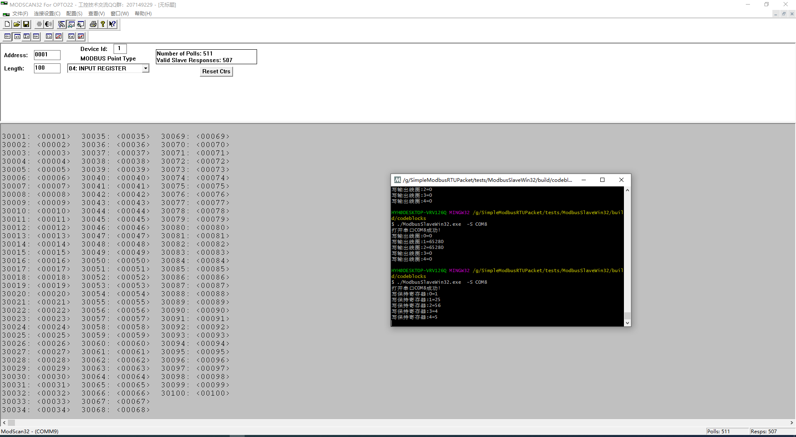
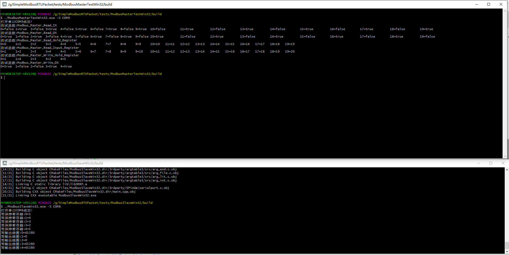

# 说明

极其简易的Modbus-RTU模式数据包处理。

一般用于单片机，本代码只包含数据包处理程序，时序部分需要在单片机其它代码中实现。

特点如下:

- 代码极其简易，便于移植。
- 可用于各类带硬件串口的单片机。
- 使用简单

缺陷:

- 串口驱动以及Modbus时序需要自行编写。
- 未进行某些检查。

# 使用

注意事项:

- 本代码中的地址都是从0开始的，但Modbus标准协议中地址规定是从1(数据帧中仍然是从0开始)开始。

## 主机

主机主要使用modbus_master_context_t结构体及 Modbus_Master开头的函数。主要步骤如下:

- 定义modbus_master_context_t结构体,并填写相关成员(回调函数需自行定义，通常不可为NULL)。
- 当需要请求数据时,调用Modbus_Master系列函数。

## 从机

主机主要使用modbus_slave_context_t结构体及 Modbus_Slave_Parse_Input函数。主要步骤如下:

- 定义modbus_slave_context_t结构体,并填写相关成员(回调函数需自行定义，通常不可为NULL)。
- 当串口接收到一帧数据时,调用 Modbus_Slave_Parse_Input函数。

# Doxygen文档

进入doc目录后，直接运行doxygen程序,可在output目录中得到最新的文档。

已编译的文档见 [doc/html/index.chm](doc/html/index.chm)

# 测试


## 源代码下载

由于本源代码包含第三方源代码,故直接下载可能有部分源代码缺失，需要通过以下方法解决:

- 在进行git clone 使用--recurse-submodules参数。

- 若已通过git clone下载,则在源代码目录中执行以下命令下载子模块:

  ```bash
   git submodule update --init --recursive
  ```

## 工具

- VSPD：虚拟串口驱动
- ModScan32：Modbus上位机软件

## 编译

本测试均在MSYS2环境下使用CMake编译,可直接进入相应测试程序目录使用CMake编译。

注意:需要安装对应环境的GCC编译器、CMake、make(或者ninja)等

## ModbusSlaveWin32

Modbus从机测试,仅支持Windows。

### 虚拟串口设置


### ModScan32测试结果





## ModbusMasterTestWin32

主机测试,仅支持Windows。需要ModbusSlaveWin32。

对于主机模式的Modbus,通常采用更加强大的[libmodbus](https://github.com/stephane/libmodbus.git)库,本库仅用于简易使用。

### 虚拟串口设置


### 测试结果



